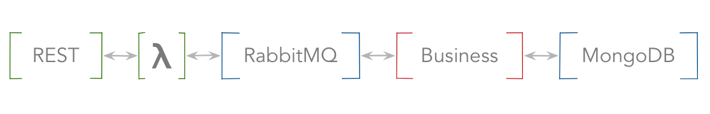

# Yonder

> Do you see yonder cloud that's almost in shape of a camel? ~ [Hamlet]

This repository contains code from my experiment in migrating a *traditional* client-server
application to a *vendor neutral* cloud application. My goal was to take an simple SpringBoot
service, write the required glue code and deploy it over yonder cloud. Then, to automate the process
(where [Terraform] helped) and then, to repeat for each major cloud vendor.

### Application

Here is the application *in spirit*



And here it is *in flesh*


To give it a *character*, I made the API fetch [Nobel Laureates].

### Usage

When it works, it looks something like the following:

```bash
> curl -H x-api-key:<gibberish> https://<endpoint>/nobel/1979/peace
[ {
  "id" : "540",
  "firstname" : "Mother Teresa",
  "surname" : null,
  "born" : "1910-08-26",
  "died" : "1997-09-05",
  "bornCountry" : "Ottoman Empire (now Republic of Macedonia)",
  "bornCity" : "Uskup (now Skopje)",
  "diedCountry" : "India",
  "diedCity" : "Calcutta",
  "gender" : "female",
  "prizes" : [ {
    "year" : 1979,
    "category" : "peace",
    "share" : "1",
    "motivation" : null
  } ]
} ]
```

Of course, it works for other categories and years too, as long as the category is one of:
`literature`, `physics`, `chemistry`, `economics`, `chemistry`, `peace` or `medicine` and the year
between 1901 and 2017.

## AWS

Here is the [AWS plan].

> I used an AWS Free Tier account for this and it costed me nothing. 
> 
> That, however, is **NO GUARANTEE** on how much it could cost *you*. You've been warned.

### Prepare

```bash
# Store your credentials
> cat ~/.aws/credentials 
[default]
aws_access_key_id=<your-key-id>
aws_secret_access_key=<your-key>

# Generate an SSH key-pair
> ssh-keygen

# Do this once
> make init
```

### Deploy

Use `make deploy`. Terraform will prompt you to type `yes` to confirm your intentions.

```bash
> make deploy

... <lots of output>

Plan: 16 to add, 0 to change, 0 to destroy.

Do you want to perform these actions?
  Terraform will perform the actions described above.
  Only 'yes' will be accepted to approve.

  Enter a value: yes

... <logs of output>

Apply complete! Resources: 16 added, 0 changed, 0 destroyed.

Outputs:

Invoke the API = curl -H x-api-key:<gibberish> https://<gibberish>.execute-api.us-east-1.amazonaws.com/nobel
Login to Backend Service = ssh -i ~/.ssh/id_rsa ubuntu@<some-ip>
Login to Infrastructure Host = ssh -i ~/.ssh/id_rsa ubuntu@<some-other-ip>
```

## Undeploy

To undo everything, use `make undeploy`. Terraform will again prompt you to type `yes`

```bash
> make undeploy

... <lots of output>

Plan: 0 to add, 0 to change, 16 to destroy.

Do you really want to destroy?
  Terraform will destroy all your managed infrastructure, as shown above.
  There is no undo. Only 'yes' will be accepted to confirm.

  Enter a value: yes
  
... <lots of output>


Destroy complete! Resources: 16 destroyed.
```

And then, you can do it all over again.

[Terraform]: https://www.terraform.io/
[Nobel Laureates]: http://api.nobelprize.org/v1/laureate.json
[Hamlet]: http://shakespeare.mit.edu/hamlet/hamlet.3.2.html#speech133
[AWS plan]: clouds/aws/plan.png
